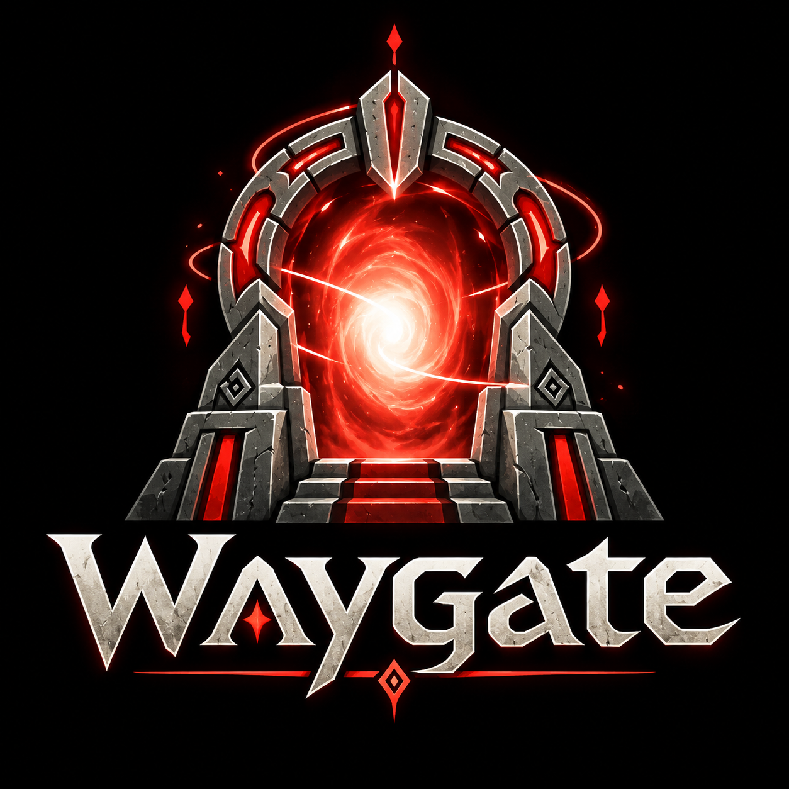

<p align="center"></p>

# Waygate

**A Warcraft III toolchain from the future.**

Modern tooling, testing, build automation, and developer experience for Warcraft III modding.

Waygate compiles TypeScript into Warcraft III's Lua, applies the game's numeric
rules, reloads code into running clients, maps Lua errors back to TypeScript,
and provides shared map packaging, file transport and client controls. Host
tools run in Bun and use Effect. Synchronized game code stays in TypeScript
that TypeScriptToLua can compile.

Waygate owns the compiler, numeric guards and helpers, reload runtime, host
services, and generic archive operations. Games own their simulation, UI,
assets, map declaration, import list, and acceptance journeys. Smashcraft is
the first consumer; Waygate does not import or read its source.

## Develop Waygate

The exact Bun, TypeScript, TypeScriptToLua and Effect versions are recorded in
waygate:typescript-toolchain.lock. From the checkout root:

```sh
bun install --frozen-lockfile
bun run check
LUA=/path/to/lua32 bun run test
```

The test command requires Lua 5.3 built with `LUA_32BITS`, matching Warcraft's
32-bit integers and binary32 floats. It compiles and executes the numeric and
payload checks; an ordinary 64-bit Lua is a different runtime.

Source is under waygate:src/; Bun host services are under
waygate:scripts/waygate/; the compiler plugin is
waygate:plugins/warcraft-numbers.ts. Focused tests are under waygate:test/.
Generated bundles and checker caches stay in waygate:build/.

## Consume a pinned revision

Smashcraft records an immutable Waygate commit and consumes its generated
source archive through Bun. The archive is dependency output; maintained
framework source lives here. This keeps clean installs and CI independent of
private-repository credentials. No registry release is required.

Host services receive the project's paths, file prefix, map declaration,
object data and import list explicitly. The runtime accepts matching file and
persistent-state names through `configureRuntime()`. This preserves a running
game's existing state when its code reloads. Project commands compose these
services with the game's own fresh-match, replay and integrity checks.

See smashcraft:docs/typescript.md for the consumer's actual commands and
smashcraft:ts/scripts/update-waygate.ts for updating its recorded revision.
